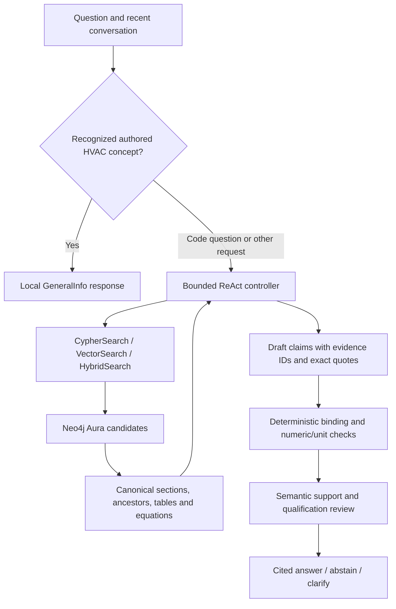

# HVAC Codes GraphRAG Assistant

A source-linked HVAC knowledge assistant built with **Streamlit, Neo4j Aura, and the OpenAI Responses API**. It answers questions about the included HVAC code compilation, retrieves the relevant sections and their context, checks draft claims against source passages, and returns section/page citations or an abstention when support is insufficient.

The application also provides a searchable section library, original PDF pages, conversation export, and an answer inspector showing recorded retrieval actions and citation dependencies.

## What has been built

- **Document ingestion and provenance:** a 306-page PDF parsed into 897 numbered sections across 8 chapters, with nested headings, lists, exceptions, 34 canonical tables containing 543 rows, 15 equation records, and 1,568 reference records.
- **Hierarchical knowledge graph:** `Document`, `Chapter`, `Section`, and `Requirement` nodes in Neo4j Aura. The loaded graph contains 2,573 requirement records; its 898 Section nodes include one internal unassigned-content bucket.
- **Three retrieval tools:** bounded Cypher lookups, semantic vector search, and reciprocal-rank-fused hybrid search combining lexical, full-text, and vector candidates.
- **Evidence expansion:** matching passages resolve to canonical section text, parent sections, explicitly linked tables, and equations, with source-page provenance.
- **Answer validation:** exact evidence identifiers and quotations, numeric checks, recognized numeric/unit pair checks, and a separate semantic review of support, relevance, conditions, and exceptions.
- **Bounded execution:** at most 6 tool calls per question, query transaction timeouts, result/context/output limits, resumable checkpoints, and an optional API spend ledger.
- **General HVAC explanations:** a defined set of authored concept responses, served locally when recognized. Code requirements always use the retrieval path.
- **Evaluation and regression checks:** frozen retrieval comparisons, fixed-retrieval answer checks, historical end-to-end ReAct evaluation, and offline tests using controlled model/database clients.

## Architecture



The controller can search again after observing a result. GeneralInfo is also available as a scoped tool during the controller loop. ReAct is the reasoning-and-tool-use pattern; the user interface is Streamlit.

The graph stores document hierarchy and retrievable requirements:

```text
Document -CONTAINS-> Chapter -CONTAINS-> Section
Section  -CONTAINS-> nested Section
Section  -STATES---> Requirement
```

Vector retrieval uses `Requirement.retrieval_embedding`, the `hvac_passage_embeddings` index, and 3,072-dimensional `text-embedding-3-large` embeddings. Hybrid retrieval deduplicates by section and combines rankings with reciprocal-rank fusion. Final answers are assembled from the local canonical corpus rather than treating a short graph result as the complete rule.

## Results

### Retrieval comparison — September 24, 2026

The frozen set contains 20 development cases and 120 held-out cases. Mean section recall@5 is calculated over the **110 source-backed held-out cases**; 10 ambiguous or out-of-scope cases are evaluated separately.

| Retrieval method | Mean section recall@5 |
| --- | ---: |
| Legacy result concatenation | 28.6% |
| Vector retrieval | 79.1% |
| Reciprocal-rank fusion | 79.1% |

Fusion improved recall by **50.5 percentage points** over concatenation and matched vector-only retrieval. This experiment measures section ranking, not answer accuracy or the independent contribution of graph traversal.

### Fixed-retrieval answer evaluation

| Retrieval method | Passed automated source checks | Abstained / clarified | Negative-case abstention | Answer p50 / p95 |
| --- | ---: | ---: | ---: | ---: |
| Vector | 46/120 | 74/120 | 90% | 4.66 / 11.41 s |
| Legacy concatenation | 14/120 | 106/120 | 100% | 2.59 / 6.08 s |
| Rank fusion | 40/120 | 80/120 | 100% | 3.94 / 9.11 s |

All 360 answer checks completed without service errors. The conservative shared spend ledger recorded **$0.635521**, including setup and initial probes. Latency covers synthesis with four concurrent workers and excludes retrieval. These checks reuse frozen retrieval results; they are not 360 end-to-end agent runs.

The questions were generated from source titles and features, and this set was used for engineering regression. Independently expert-labeled correctness, unsupported-claim rate, and exception completeness remain unmeasured. Passing automated source checks is a separate result from expert correctness.

### Historical end-to-end ReAct benchmark

A separate 20-question run recorded **20/20 expected evidence coverage**, **18/20 completed and citation-valid answers**, and **17/20 manually reviewed grounded-correct answers**. These historical results should not be read as a fresh measurement of the current checkout.

See [evaluation protocol and limitations](evals/README.md), [aggregate results](evals/results-2026-09-24.json), and the [historical benchmark](v2_output/react/phase8_final_react_benchmark_summary.md).

## Setup

### Prerequisites

- Python 3.11.
- An OpenAI API key with access to the configured response and embedding models. Defaults are `gpt-5.6-luna` and `text-embedding-3-large`.
- A populated Neo4j Aura database with the graph schema above and an online `hvac_passage_embeddings` index configured for 3,072 dimensions.

The application checks database connectivity, vector-index state/dimensions, and the PDF source hash recorded in Aura. Starting Streamlit does **not** create a database, ingest the corpus, or generate embeddings. A different response model can be set through `OPENAI_MODEL`; the optional spend ledger supports only models with rates defined in its implementation.

### 1. Clone and install

The repository's default branch contains the current application; no branch switch is required.

```powershell
git clone https://github.com/namanjain4463/Intelligent-RAG-Based-Knowledge-Management-System-for-HVAC-Codes.git
cd Intelligent-RAG-Based-Knowledge-Management-System-for-HVAC-Codes
py -3.11 -m venv venv
.\venv\Scripts\python.exe -m pip install -r requirements-runtime.txt
```

On macOS/Linux, use `python3.11 -m venv venv` and `venv/bin/python -m pip install -r requirements-runtime.txt`.

### 2. Configure credentials

```powershell
if (-not (Test-Path .env)) { Copy-Item .env.example .env }
```

Edit `.env` with your own settings:

```dotenv
OPENAI_API_KEY=your-openai-api-key
OPENAI_MODEL=gpt-5.6-luna
OPENAI_EMBEDDING_MODEL=text-embedding-3-large

NEO4J_URI=neo4j+s://your-aura-host.databases.neo4j.io
NEO4J_USERNAME=your-application-user
NEO4J_PASSWORD=your-aura-password
NEO4J_DATABASE=your-aura-database-name

VECTOR_INDEX_NAME=hvac_passage_embeddings
VECTOR_DIMENSION=3072
```

Use a database identity with the minimum read privileges needed by the application. `.env` is ignored by Git. Restart Streamlit after changing credentials so the process loads the new values. Set `HVAC_ENV_FILE` if credentials are stored in a separate private file.

### 3. Start the application

```powershell
.\venv\Scripts\python.exe -m streamlit run bot.py --server.address 127.0.0.1
```

Open `http://localhost:8501`. On macOS/Linux, replace the executable with `venv/bin/python`. Stop the server with `Ctrl+C`.

To use the command-line entry point:

```powershell
.\venv\Scripts\python.exe agent.py
```

The optional PowerShell launcher selects the configured graph index and supports a private environment file and custom port:

```powershell
.\scripts\start.ps1 -EnvFile "C:\path\to\private\.env" -Port 8501
```

### Using the workspace

- **Chat:** ask a concept question, a specific section question, or a question about an equipment requirement. Follow-up messages retain recent conversation context.
- **Sections:** search the complete numbered-section list and read the canonical source passages.
- **PDF:** view the original source page. Answer references also provide page previews and downloads.
- **Explore the answer:** inspect recorded tool calls, section relationships, and citation dependencies. Removing a reference here is an offline inspection exercise; it does not regenerate the answer.

Example questions: `What is a heat pump?`, `What does Section 303.7 require?`, and `What are the exceptions in Section 303.3?`.

### Optional spending limit

```powershell
$env:HVAC_SPEND_LEDGER = "$PWD\.cache\chat-spend.json"
$env:HVAC_SPEND_CAP_USD = "1"
.\venv\Scripts\python.exe -m streamlit run bot.py --server.address 127.0.0.1
```

The ledger reserves conservative estimated costs before API requests and retains uncertain reservations after failures. It coordinates threads within one process; do not share the file between concurrent processes. Without these settings, normal chat requests use your OpenAI account directly.

### Building your own database

The repository contains the source PDF and canonical records. Full PDF ingestion uses the separate `v2_requirements.txt` dependency stack. Detailed ingestion, graph-loading, and embedding procedures are in [setup documentation](V2_SETUP.md) and [operations](OPERATIONS.md). These steps make database/API changes and are separate from launching the chat.

## Validation

Run the offline regression suite:

```powershell
.\venv\Scripts\python.exe -m unittest discover -s tests_v2
```

These tests exercise ingestion/provenance, equation ownership, retrieval fusion, claim binding, numeric/unit mismatches, conversation behavior, resource limits, checkpoint resume, and Streamlit controls. Controlled clients keep the suite independent of live OpenAI and Aura availability.

Equation metadata can be checked against the PDF without making network calls:

```powershell
.\venv\Scripts\python.exe -m scripts.reconcile_equations
```

Add `--write` to repair the canonical equation/link metadata and matching Parquet columns after checking the report.

Live evaluation commands and their shared cost limits are documented in [evals/README.md](evals/README.md). They make paid API requests and require the populated Aura instance.

## Repository map

| File / directory | Purpose |
| --- | --- |
| `bot.py` | Streamlit chat, section browser, PDF viewer, and answer inspector |
| `agent.py` | Command-line application entry point |
| `v2_ingestion/react_runtime.py` | Controller, retrieval tools, canonical evidence, validation, and checkpoints |
| `v2_ingestion/answer_validation.py` | Claim schema, exact quotations, and recognized numeric/unit checks |
| `v2_ingestion/equation_links.py` | Equation ownership using physical PDF heading positions |
| `v2_ingestion/ranking.py` | Reciprocal-rank fusion |
| `v2_output/document.json` | Canonical document structure and source provenance |
| `v2_output/semantic/requirements.parquet` | Extracted requirement records and review metadata |
| `HVAC-Codes.pdf` | Included source compilation |
| `requirements-runtime.txt` | Runtime and offline-test dependencies |
| `tests_v2/` | Offline regression suite |
| `evals/` | Evaluation cases, aggregate results, and measurement protocol |

Directory names are retained for compatibility. `bot.py` and `agent.py` select the current implementation; historical LangChain modules and architecture documents are not its active runtime.

## Scope and remaining validation

The assistant covers the included source compilation. Its complete edition/jurisdiction has not been independently established. Source accounting preserves extraction gaps for review; it does not establish perfect interpretation of every clause. Numeric/unit checks recognize defined unit aliases, while semantic review checks meaning and qualifications. Independent expert review is still needed to measure false acceptance, false rejection, and exception completeness.

Application query checks and read routing do not replace database access control. The tested Aura identity has an administrative role; use a restricted application identity before exposing a deployment. Verify answers against the applicable original code document when making a design or compliance decision.
